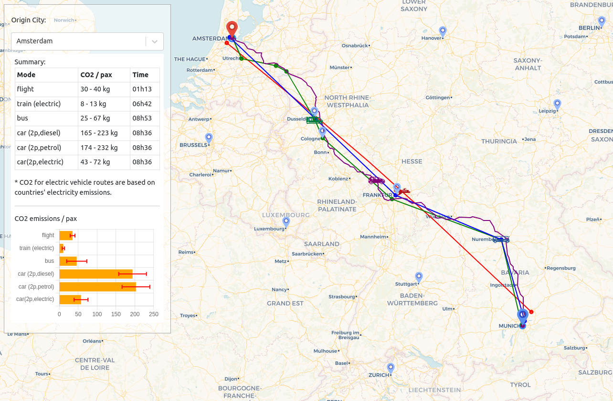

## Copula

Multi-model transport emission analysis framework

### Front-end

- React
- Leaflet

### Back-end

- Python
- FastAPI
- OpenAP
- pandas / GeoPandas

### Data source

- GTFS (Bus & Train routes)
- OpenStreetMap (Car routes)
- EUROCONTROL R&D data (Flight route)
- OpenAP (Flight emissions)

## Example

